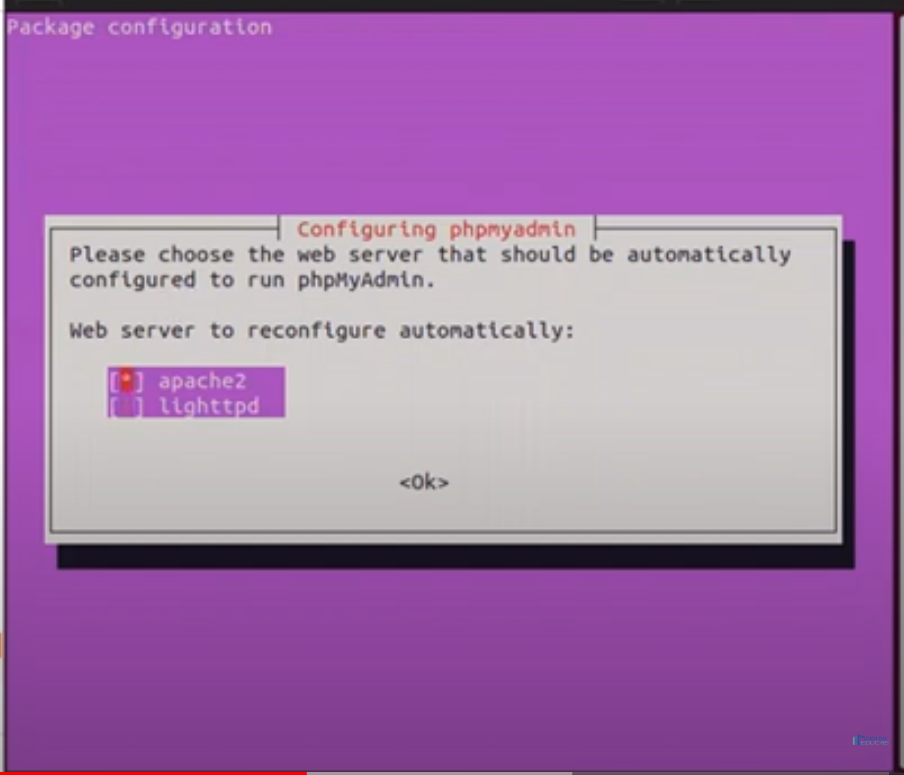

Lo que se necesita para que tu pc funcione para todo tipo de desarrollo son las siguientes apps:

NOTA: *Las configuraciones y todo se encuentran dentro de: ../gnu.md*
APPS:
## MariaDB
~~~
{
    -> sudo apt install mariadb-server
    -> sudo service mariadb status
    -> sudo apt install php-mysql
    -> sudo mysql_secure_installation (en la primera opcion darle enter y lo demas n con eso queda)
}
~~~
## Apache2
~~~
{
    -> sudo apt update
    -> sudo apt install apache2
    -> sudo service apache2 status
}
~~~
## php version 8.1
~~~
{
    -> sudo apt install php libapache2-mod-php php-mysql
    este comando instala el php de la versiones mas recientes que van saliendo

    -> sudo apt install software-properties-common apt-transport-https -y
    -> sudo add-apt-repository ppa:ondrej/php -y
    -> sudo apt install php8.1 php8.1-common libapache2-mod-php8.1 php8.1-cli
    -> sudo aptitude install php-common
    -> Sudo aptitude install php-mysql
    -> sudo service apache2 restart
}
~~~
## PHPMYADMIN
~~~
Para ver las imagenes usa la extencion 'Markdown All in One' usando la vista previa podras ver las imagenes :) u crtl+shift+v
{
    -> sudo apt-get install -y php php-tcpdf php-cgi php-pear php-mbstring libapache2-mod-php php-common php-phpseclib php-mysql
    -> sudo apt install phpmyadmin php-mbstring php-zip php-gd php-json php-curl
    con el espacio puedes seleccionar la casilla marcada, en este caso es apache2 que es la BD instalada en linux
    posteriormente das enter para continuar
~~~

~~~
    La siguiente configuracion das enter, con la opcion si o yes

    Saldra otra configuracion, ahi creas una contraseña, que la que PMA agrega a la base de datos y lo confirmas
~~~

~~~
    -> sudo phpenmod mbstring
    -> sudo systemctl restart apache2

    terminando la instalacion entras a localhost/phpmyadmin/
    inicias sesion con unas de las cuentas que usas en mariadb (excepto root, al no poseer contraseña no te deja iniciar sesion)
}
~~~
## composer
~~~
{
    -> sudo apt-get update
    -> sudo apt install curl php-cli 
    -> sudo apt install curl php-mbstring
    [Instalar composer de manera Global]
    -> curl -sS https://getcomposer.org/installer | php
            sudo mv composer.phar /usr/local/bin/composer
            sudo chmod +x /usr/local/bin/composer
    -> Crear Proyecto: composer create-project laravel/laravel=8.* 'nombreProyecto'
    -> Para que composer no ejecute lento instalar:{
        -> sudo apt-get install php-curl
    }
    Si el composer dice que tiene un error en el dom, utilizar el siguiente comando{
        -> sudo apt-get install php-xml
    }
}
~~~
## node,npm:
~~~
{
    -> curl -fsSL https://deb.nodesource.com/setup_16.x | sudo -E bash -
    -> sudo apt-get install -y nodejs
    verificamos las versiones
    ->comando de version de node{
        -> node --version
        }
    ->comando de version de npm{ 
        -> npm --version
        }

}
~~~
## Samba:
~~~
{
    -> sudo aptitude install samba
}
~~~
## neofetch: 
~~~
{
    sudo aptitude install neofetch
}
~~~

## SSH:
~~~
{
    Generar llave: {
        ssh-keygen
    }
    sudo aptitude install openssh-server
}
~~~

### cuando se tienen bloqueados los paquetes:
~~~
commands{
    ->sudo dpkg --configure -a
}
~~~