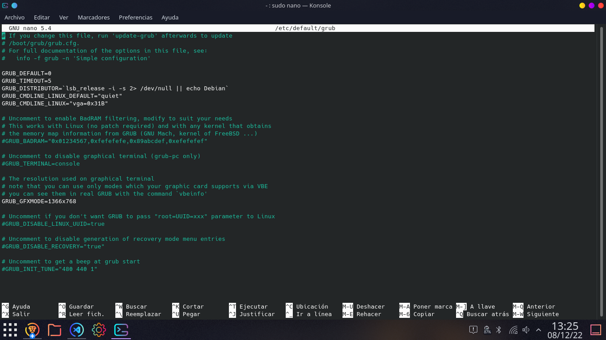

# Se necesitan hacer las siguientes configuraciones para poder utilizar el debian de manera correcta

### Cambiar el tamaño del grub 
~~~
    -> Lo que tienes que hacer es:
        En una terminal debes poner lo siguiente
         $sudo nano /etc/default/grub
        Buscar en el archivo lo siguiente:
         $GRUB_CMDLINE_LINUX="vga=0x31B"
         $GRUB_GFXMODE=1366x768 //Aqui ira la resolución de tu pantalla y de acuero a la siguiente pagina web, puedes poner los     
        datos:
        https://elbauldelprogramador.com/como-cambiar-la-resolucion-de-pantalla-en-las-ttys-de-gnulinux/
~~~
