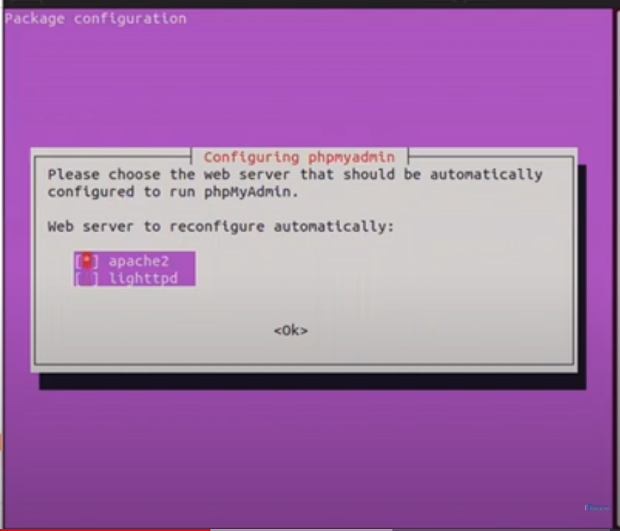
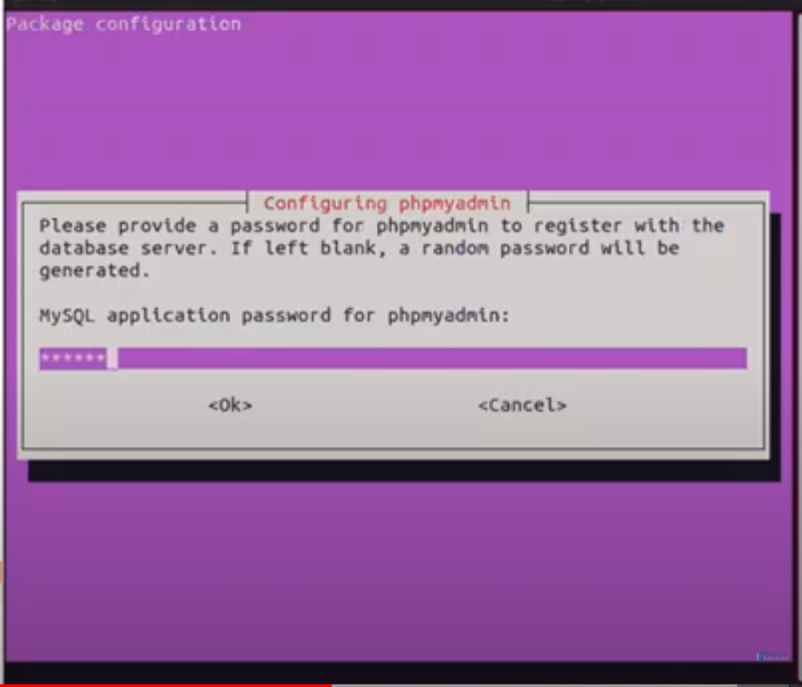

Lo que se necesita para que tu pc funcione en mod desarrollador son las siguientes apps:

NOTA: *Las configuraciones y todo se encuentran dentro de: ../gnu.md*
APPS:
## MariaDB
~~~
{
    -> sudo apt install mariadb-server
    -> sudo service mariadb status
    -> sudo mysql_secure_installation (en la primera opcion darle enter y lo demas n con eso queda)

    Para hacer funcionar el mysql
    -> sudo mariadb
    ->GRANT ALL ON *.* TO 'nameUser'@'localhost' IDENTIFIED BY 'pass' WITH GRANT OPTION; //funciona para crear un nuevo usuario
    -> FLUSH PRIVILEGES; //dar todos los permisos
    -> EXIT
}
~~~
## Apache2
~~~
{
    -> sudo apt update
    -> sudo apt install apache2
    -> sudo service apache2 status

    cortafuegos para ubuntu
    Abrir cortafuegos -> ufw enable ---despues de estar abierto salta hasta agregar apache
    checar que este activo -> ufw status
    agregar apache al cortafuegos -> sudo ufw allow in "Apache"

    En debian no es necesario habilitar ufw...
}
~~~
## php version
~~~
{
    antes de hacer instalaciones, siempre actualiza el sistema, solo update

    instalacion para ubuntu
    -> sudo apt install php libapache2-mod-php php-mysql
    Comando rapido, se instalara la version automaticamente que utiliza el sistema por default

    versiones recomendadas, instalaciones manuales y recomendado...
    php8.1 => ubuntu
    -> sudo apt install software-properties-common apt-transport-https -y
    -> sudo add-apt-repository ppa:ondrej/php -y
    -> sudo apt install php8.1 libapache2-mod-php8.1 php8.1-cli
    -> sudo apt install php-common
    -> sudo apt install php-mysql
    -> sudo service apache2 restart

    php8.1 => debian
    -> sudo apt-get install ca-certificates apt-transport-https software-properties-common wget curl lsb-release -y
    -> curl -sSL https://packages.sury.org/php/README.txt | sudo bash -x
    -> sudo apt update
    -> sudo apt upgrade
    -> sudo apt install php8.1 libapache2-mod-php8.1 php8.1-cli
    -> sudo apt install php-common
    -> sudo apt install php-mysql
    -> sudo service apache2 restart

    Para revisar la información de php es creando un archivo .php y dentro del archivo contendra
    -> <?php phpinfo(); ?>
    posteriormente buscar el controlador mysqli y mysqli_PDO, puesto que son los que se utilizara en los proyectos que se realicen conexiones, en caso de no tener esos controladores mencionados, instalarlos manualmente
    MySQLi, MySQL PDO
    -> sudo apt-get install php8.1-mysql

    controladores opcionales, son scriptcase, herramientas de rapido desarrollo
    -> sudo apt-get install php8.1-curl php8.1-gd php8.1-bcmath php8.1-cgi php8.1-ldap php8.1-mbstring php8.1-xml php8.1-soap php8.1-xsl php8.1-zip

    PostgreSQL PDO, PostgreSQL 6.3 o abajo, PostgreSQL 6.4 o mayor, PostgreSQL 7 o mayor
    -> sudo apt-get install php8.1-pgsql

    SQLite PDO
    -> sudo apt-get install php8.1-sqlite3

    Firebird, Interbase 6, Interbase 6.5, Firebird PDO
    -> sudo apt-get install php8.1-interbase

    DB2 ODBC GENERIC, DB2 ODBC GENERIC 6, Generic ODBC, MS Access ODBC, Oracle ODBC, Progress, DB2 PDO ODBC, Progress PDO ODBC, Sybase PDO ODBC
    -> sudo apt-get install php8.1-odbc

    DBLIB, Sybase PDO DBLIB
    -> sudo apt-get install php8.1-sybase

    php8.2 => debian
    -> sudo apt-get install ca-certificates apt-transport-https software-properties-common wget curl lsb-release -y
    -> curl -sSL https://packages.sury.org/php/README.txt | sudo bash -x
    -> sudo apt update
    -> sudo apt upgrade
    -> sudo apt install php8.2 libapache2-mod-php8.2 php8.2-cli
    -> sudo apt install php-common
    -> sudo apt install php-mysql
    -> sudo service apache2 restart
    
    
}
~~~
## PHPMYADMIN
~~~
Para ver las imagenes usa la extencion 'Markdown All in One' usando la vista previa podras ver las imagenes :) u crtl+shift+v
{
    -> sudo apt-get install -y php php-tcpdf php-cgi php-pear php-mbstring libapache2-mod-php php-common php-phpseclib php-mysql
    -> sudo apt install phpmyadmin php-mbstring php-zip php-gd php-json php-curl
    con el espacio puedes seleccionar la casilla marcada, en este caso es apache2 que es la BD instalada en linux
    posteriormente das enter para continuar
~~~

~~~
    La siguiente configuracion das enter, con la opcion si o yes

    Saldra otra configuracion, ahi creas una contraseña, que la que PMA agrega a la base de datos y lo confirmas
~~~

~~~
    -> sudo phpenmod mbstring
    -> sudo systemctl restart apache2

    terminando la instalacion entras a localhost/phpmyadmin/
    inicias sesion con unas de las cuentas que usas en mariadb (excepto root, al no poseer contraseña no te deja iniciar sesion)
}
~~~

## composer
~~~
{
    -> sudo apt-get update
    -> sudo apt install curl php-cli 
    -> sudo apt install curl php-mbstring
    [Instalar composer de manera Global]
    -> curl -sS https://getcomposer.org/installer | php
            sudo mv composer.phar /usr/local/bin/composer
            sudo chmod +x /usr/local/bin/composer
    -> Crear Proyecto: composer create-project laravel/laravel=8.* 'nombreProyecto'
    -> Para que composer no ejecute lento instalar:{
        -> sudo apt-get install php-curl
    }
    Si el composer dice que tiene un error en el dom, utilizar el siguiente comando{
        -> sudo apt-get install php-xml
    }
}
~~~

## node,npm:
~~~
{
    -> curl -fsSL https://deb.nodesource.com/setup_16.x | sudo -E bash -
    -> sudo apt-get install -y nodejs
    verificamos las versiones
    ->comando de version de node{
        -> node --version
        }
    ->comando de version de npm{ 
        -> npm --version
        }

}
~~~
## Samba:
~~~
{
    -> sudo apt install samba
}
~~~
## neofetch: 
~~~
{
    sudo apt install neofetch
}
~~~
### git:
~~~
{
    -> sudo apt install git
}
~~~

## SSH:
~~~
{
    -> cd /etc/ssh
    -> sudo nano sshd_config
    // solo cambiamos el puerto que esta por defecto (22) al puerto 443
    Generar llave: {
        ssh-keygen
    }
    sudo apt install openssh-server
}
~~~

### instalar Brave
~~~
{
    -> sudo apt install apt-transport-https curl
    -> sudo curl -fsSLo /usr/share/keyrings/brave-browser-archive-keyring.gpg https://brave-browser-apt-release.s3.brave.com/brave-browser-archive-keyring.gpg
    -> echo "deb [signed-by=/usr/share/keyrings/brave-browser-archive-keyring.gpg arch=amd64] https://brave-browser-apt-release.s3.brave.com/ stable main"|sudo tee /etc/apt/sources.list.d/brave-browser-release.list
    -> sudo apt update
    -> sudo apt install brave-browser
}
~~~

### instalar visual estudio
~~~
{
    ->sudo apt update && sudo apt install software-properties-common apt-transport-https wget
    ->wget -q https://packages.microsoft.com/keys/microsoft.asc -O- | sudo apt-key add -
    -> sudo add-apt-repository "deb [arch=amd64] https://packages.microsoft.com/repos/vscode stable main"
    -> sudo apt install code
}
~~~

## cambiar fuetes sobre flecha =======> 
~~~
  -> https://github.com/tonsky/FiraCode/releases =>> instalar
~~~

### cuando se tienen bloqueados los paquetes:
~~~
commands{
    ->sudo dpkg --configure -a
}
~~~

### Github sin contraseña por ssh
~~~
pasos:
1.- Ir a la configuración y buscar SSH and GPG keys
2.- Crear una nueva llave de ssh y colocar dentro el archivo id_rsa.pub
3.- Verificar que el repo este en ssh y no en https
~~~